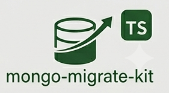

<div align="center">



# mongo-migrate-kit

**Elegant, fast, TypeScript-first MongoDB migrations for Node.js.**

_A modern, drop-in replacement for `migrate-mongo` etc._

[](https://www.npmjs.com/package/mongo-migrate-kit)
[](https://www.typescriptlang.org/)
[](https://nodejs.org)
[](https://www.mongodb.com)
[](https://socket.dev/npm/package/mongo-migrate-kit/overview/1.2.0)


Single-file runs · per-batch rollback · dry-run previews · transactions · lifecycle hooks ·
SHA-256 tamper detection · MongoDB-native locking · an append-only audit trail — all behind one
small `mmk` CLI and a fully-typed API.

</div>

---

## Why mongo-migrate-kit

Built for teams who outgrew the basics. You keep everything you expect — `up`, `down`, `create`,
`status` — and gain the features the older tools never added:

- **Dry-run previews** — `mmk dry-run up` shows exactly what would run before anything touches the
  database (something `migrate-mongo` users have [asked for since 2019](https://github.com/seppevs/migrate-mongo/issues/43)).
- **Run one file at a time** — `mmk up <file>` / `mmk down <file>`, not just "all pending" or "the last one".
- **Real rollbacks** — revert any batch (`--batch 3`), the last N migrations (`--steps 2`), a single
  migration, or `redo` in one step — instead of only the most recently applied migration.
- **A cleaner, richer CLI** — a focused set of commands with colorized output and a status table,
  versus the bare `init`/`create`/`up`/`down`/`status` set.
- **Safe by default** — an atomic MongoDB lock (with a renewal heartbeat for long migrations) stops
  two deploys racing; SHA-256 checksums catch edited migrations before they silently re-run; and
  `mmk unlock` clears a lock left by a crashed run.
- **CI-friendly** — `--json` on every data command for clean machine-readable output, and
  `mmk status --check` exits non-zero when migrations are pending so you can gate a deploy.
- **First-class TypeScript _and_ JavaScript** — `.ts` (via `tsx`), ESM, and CommonJS all just work,
  with a fully-typed context and config — no `ts-node` plumbing.
- **Zero config files required** — drive everything from env vars, or generate a documented config with `mmk init`.
- **Audit-ready** — every run records duration, checksum, environment, user, and batch, and the
  history is **never deleted** (a rollback updates the record, it doesn't remove it).

### How it compares to `migrate-mongo`

| Capability | `migrate-mongo` | `mongo-migrate-kit` |
|---|:---:|:---:|
| `up` / `down` / `create` / `status` | ✅ | ✅ |
| Dry-run preview | ❌ | ✅ |
| Run a single migration file | ❌ | ✅ |
| Roll back a specific batch or file | ❌ *(last only)* | ✅ |
| `redo` (down + up) | ❌ | ✅ |
| SHA-256 checksum / tamper detection | ❌ | ✅ |
| Lifecycle hooks | ❌ | ✅ |
| First-class TypeScript | community setup | ✅ built-in |
| History preserved on rollback | ❌ *(entry removed)* | ✅ *(never deleted)* |
| Adopt an existing `migrate-mongo` changelog | — | ✅ `mmk import` |

<sub>Reflects `migrate-mongo`'s documented CLI as of mid-2026. It has since added transaction access
via a `client` argument; `mmk` exposes the same plus a declarative per-file `useTransaction` flag.</sub>

> [!TIP]
> ### 🔄 Already using `migrate-mongo`? Switch in under a minute.
>
> `mmk` adopts your existing `changelog` **as-is** — no re-running migrations, no data loss, no rewriting
> files. Point it at the same database and bring your whole history over in one command:
>
> ```bash
> mmk import     # one-time: adopt your migrate-mongo changelog (it's never modified)
> mmk up         # applies only what's new — your past migrations are recognized as already applied
> ```
>
> Your applied history is preserved and new migrations run normally. Your `up`/`down`/`create`/`status`
> mental model carries over 1:1 — you just gain dry-runs, single-file control, real rollbacks, hooks,
> and locking. → **[See how it works](#advanced-features)**

---

## Quick start

```bash
npm install mongo-migrate-kit
npm install mongodb          # required peer dependency
```

```bash
# 1 · create a configuration file mmk.config.*. (pass --ts if need ts file)
npx mmk init

# 2 · create your first migration
npx mmk create "add users email index"

# 3 · run everything pending
npx mmk up

# 4 · see where you stand
npx mmk status
```

A migration is just an `up` and a `down`:

```ts
import type { MigrationContext } from 'mongo-migrate-kit';

export const description = 'Add unique index on users.email';

export async function up({ db }: MigrationContext): Promise<void> {
  await db.collection('users').createIndex({ email: 1 }, { unique: true });
}

export async function down({ db }: MigrationContext): Promise<void> {
  await db.collection('users').dropIndex('email_1');
}
```

> Prefer no files at all? Skip `mmk init` and export `MMK_URI` and `MMK_DB` — that is enough to run.

---

## Commands

Every command accepts the global flags `--uri`, `--db`, `--dir`, and `--config`.

| Command | What it does |
|---|---|
| `mmk init` | Create a documented `mmk.config.*` in the current directory |
| `mmk import` | Adopt an existing `migrate-mongo` changelog (one-time, forward-only) |
| `mmk create <name>` | Generate a timestamped migration file |
| `mmk up [file]` | Run all pending migrations, or one named file |
| `mmk down [file]` | Roll back the last batch, a chosen batch, the last N steps, or one file |
| `mmk redo [file]` | Roll back then re-apply (the last migration, or one file) |
| `mmk status` | Print the full migration status table (`--check` to fail CI on pending) |
| `mmk list` | List migrations, filtered by status |
| `mmk dry-run <up\|down> [file]` | Preview a run without touching the database |
| `mmk unlock` | Force-release a stuck lock left behind by a crashed run |

Most data commands (`up`, `down`, `redo`, `status`, `list`, `dry-run`, `import`, `create`,
`unlock`) accept **`--json`** for machine-readable output — see [CI & automation](#ci--automation).

<details>
<summary><b>Options for every command</b></summary>

```bash
# init — generate a config file
mmk init                     # mmk.config.js (default)
mmk init --js                # mmk.config.js (explicit default)
mmk init --ts                # mmk.config.ts
mmk init --json              # mmk.config.json  (NOTE: here --json picks the file format)
mmk init --secret-provider   # async config that loads the URI from a secret manager (js/ts only)
mmk init --force             # overwrite an existing config file
mmk init --uri mongodb://localhost:27017 --db my_app   # prefill the generated config

# import — adopt an existing migrate-mongo changelog
mmk import                   # read `changelog`, write the mmk changelog
mmk import --from <name>     # read a differently-named source collection
mmk import --to <name>       # write to a specific collection (default: config migrationsCollection)
mmk import --dry-run         # preview the mapping, write nothing
mmk import --trust-hash      # reuse migrate-mongo's fileHash instead of recomputing
mmk import --force           # proceed even if the mmk changelog already has records
mmk import --no-lock         # skip the concurrency lock (local dev only)
mmk import --json            # machine-readable output

# create — generate a migration file
mmk create <name>            # file type follows config `createExtension` (default .js)
mmk create <name> --ts       # force a .ts file
mmk create <name> --js       # force a .js file
mmk create <name> --template <path>   # use a custom template
mmk create <name> --json     # machine-readable output ({ "path": "..." })

# up — apply migrations
mmk up                       # all pending (one shared batch for the run)
mmk up <file>                # one specific file
mmk up --step                # apply each file as its own batch (revert individually later)
mmk up <file> --force        # re-run an ALREADY-applied file (asks for confirmation)
mmk up <file> --force --yes  # confirm a re-run non-interactively (required with --json)
mmk up --strict              # abort on any checksum mismatch
mmk up --no-lock             # skip the concurrency lock (local dev only)
mmk up --json                # machine-readable output (array of run results)

# down — roll back
mmk down                     # the last batch (may be several files)
mmk down <file>              # one specific file
mmk down --batch <n>         # a specific batch number
mmk down --steps <n>         # the last N migrations, newest first, ignoring batches
mmk down --no-lock           # skip the concurrency lock (local dev only)
mmk down --json              # machine-readable output (array of run results)

# redo — down then up
mmk redo                     # the most recently applied migration
mmk redo <file>              # a specific file
mmk redo --json              # machine-readable output (array of run results)

# status — full status table
mmk status                   # the full status table
mmk status --check           # exit 1 if any migration is pending (CI gate)
mmk status --json            # machine-readable output (array of status rows)

# list — filtered status
mmk list                     # all migrations
mmk list --pending           # only pending
mmk list --applied           # only applied
mmk list --json              # machine-readable output (array of status rows)

# dry-run — preview, never writes
mmk dry-run up [file]
mmk dry-run down [file]
mmk dry-run down --steps <n> # preview a step rollback (the last N migrations)
mmk dry-run up --json        # machine-readable output (array of status rows)

# unlock — clear a stuck lock after a crash
mmk unlock                   # shows the holder, prompts y/N
mmk unlock --yes             # skip the prompt
mmk unlock --json            # machine-readable output ({ "released": ..., "holder": ... })
```

**Global flags** (available on all commands): `--uri <uri>` (override `MMK_URI`),
`--db <name>` (override `MMK_DB`), `--dir <path>` (override `MMK_MIGRATIONS_DIR`),
`--config <path>` (explicit config file, overrides auto-discovery).

**`--json`** is accepted by every data command above (`up`, `down`, `redo`, `status`, `list`,
`dry-run`, `import`, `create`, `unlock`) and prints one JSON document to stdout — see
[CI & automation](#ci--automation). On `mmk init` only, `--json` instead selects the config
**file format** (`mmk.config.json`).

</details>

---

## Advanced features

<details id="migrating-from-migrate-mongo">
<summary><b>Migrating from <code>migrate-mongo</code></b> — adopt an existing changelog with <code>mmk import</code></summary>

<br>

`mmk import` reads your existing `migrate-mongo` changelog and records that history in the `mmk`
changelog, so `mmk up` knows what is already applied and runs only what is new. It is a **one-time,
forward-only** step.

```bash
# point mmk at the same database, then:
mmk import --dry-run     # preview the mapping first (writes nothing)
mmk import               # adopt the history
mmk up                   # apply only the migrations added since
```

**What it does**

- Reads the source collection (`changelog` by default; `--from` to override) and **never modifies it** —
  the mapped records are written to the `mmk` changelog (your config's `migrationsCollection`,
  `_mmk_migrations` by default; `--to` to write to a different collection).
- Maps `fileName → name`, `appliedAt → appliedAt`, and resolves a checksum: it reuses `migrate-mongo`'s
  `fileHash` when it matches the file on disk, otherwise recomputes a SHA-256 from disk (`--trust-hash`
  reuses the stored hash as-is). Records whose files are missing are still imported.
- Assigns each migration a **unique, sequential batch number** in apply order. If the `mmk` changelog
  already has records, imported batches **continue after** the existing maximum (use `--force` to import
  into a non-empty changelog).
- Leaves migration files that exist on disk but are **not** in the source changelog **pending** — they
  run on the next `mmk up`, exactly as expected for newly added migrations.

**Options**

| Flag | Default | What it does |
|---|---|---|
| `--from <collection>` | `changelog` | Source collection to read (never modified). |
| `--to <collection>` | config `migrationsCollection` (`_mmk_migrations`) | Target collection to write the adopted history to. |
| `--dry-run` | off | Preview the mapping and print the table; writes nothing. |
| `--trust-hash` | off | Reuse `migrate-mongo`'s stored `fileHash` as-is instead of recomputing the checksum from disk. |
| `--force` | off | Import into a changelog that already has records (imported batches continue after the existing max). |
| `--no-lock` | off | Skip the MongoDB concurrency lock (local dev only). |

Plus the global flags `--uri`, `--db`, `--dir`, and `--config`.

**Forward-only — imported migrations cannot be rolled back**

Adopted records are tagged `origin: 'migrate-mongo'`. `migrate-mongo` files use a positional
`up(db, client)` signature, which `mmk` does not execute (it passes a single context object). To avoid
ever corrupting your data, `mmk down` / `mmk redo` **refuse** an imported migration up front, before
running or writing anything, and tell you why:

```text
✖ Cannot roll back 1 migrate-mongo-imported migration(s): 20260101-add-index.js
```

If you need an old migration to be reversible under `mmk`, re-author its file in the native format
(named exports, single context argument — see [Migration file formats](#migration-file-formats)).

</details>

<details>
<summary><b>Transactions</b> — wrap a migration in an all-or-nothing MongoDB transaction</summary>

<br>

Opt in per file with `export const useTransaction = true` (or globally via config). The runner opens a
session, passes it through the context, and commits on success or aborts on any error. Pass the
`session` to every operation so it joins the transaction:

```ts
export const useTransaction = true;

export async function up({ db, session }: MigrationContext): Promise<void> {
  await db.collection('accounts').insertOne({ balance: 100 }, { session });
  await db.collection('ledger').insertOne({ delta: 100 }, { session });
}
```

> Transactions require a replica set or sharded cluster — MongoDB's own requirement, not a library limit.

</details>

<details>
<summary><b>Lifecycle hooks</b> — run code around the batch and each migration</summary>

<br>

Define hooks in your config file. Use them to seed data, emit metrics, or alert on failure:

```ts
hooks: {
  beforeAll:  async (ctx) => { /* once, before the batch */ },
  afterAll:   async (ctx) => { /* once, after the batch */ },
  beforeEach: async (name, ctx) => { /* before each file */ },
  afterEach:  async (name, durationMs, ctx) => { /* after each file */ },
  onError:    async (name, error, ctx) => { /* a file threw — alert, then it re-throws */ },
}
```

</details>

<details>
<summary><b>Loading secrets at runtime</b> — AWS, Google, Vault, Azure, anything</summary>

<br>

A `.ts`/`.js` config may export a **function** (sync or async) instead of an object.
`mmk` calls it once per command, so you can fetch the connection from a secret manager at run time.
The secret is **never written to disk**, and a rotated value is picked up automatically on the next run.

The library ships **no** cloud SDKs — you bring the one you already use, so any provider works:

```js
// mmk.config.js — AWS Secrets Manager
import { SecretsManagerClient, GetSecretValueCommand } from '@aws-sdk/client-secrets-manager';

export default async () => {
  const sm = new SecretsManagerClient({ region: 'us-east-1' });
  const res = await sm.send(new GetSecretValueCommand({ SecretId: 'prod/mongo' }));
  const { uri, dbName } = JSON.parse(res.SecretString ?? '{}');
  return { uri, dbName };  // merged at the config-file tier — env vars / flags still override
};
```

Run `mmk init --secret-provider` to scaffold this form with an AWS example you can swap for any provider.
If the function throws, it surfaces as a `ConfigInvalidError` with the cause attached.

</details>

<details>
<summary><b>Batches &amp; step rollback</b> — group a deploy, or revert file-by-file</summary>

<br>

A **batch** is one `mmk up` run. By default every migration applied in a single run shares one batch
number, so `mmk down` rolls back that whole run as a unit — the same model used by **Laravel** and
**Knex**. That keeps a deploy atomic: one command applied it, one command reverts it.

When you want finer control, two flags mirror Laravel's `migrate --step` / `migrate:rollback --step`:

- **`mmk up --step`** — apply each file in the run as its **own** sequential batch instead of one shared
  batch. A later `mmk down` then peels them off one at a time.
- **`mmk down --steps <n>`** — revert the **last N applied migrations**, newest first, counted as
  individual files **regardless of batch**. `mmk down --steps 1` reverts just the single most-recently
  applied migration; a larger N can cross batch boundaries, so preview it first with
  `mmk dry-run down --steps <n>`.

`--steps` is mutually exclusive with `--batch` and a filename. Migrations are always reverted
newest-first, so `up` followed by `down --steps <same n>` returns you to the starting state.

</details>

<details>
<summary><b>Concurrency lock &amp; checksums</b> — safe concurrent deploys, tamper detection</summary>

<br>

**Lock.** Each run acquires an atomic lock document in `_mmk_locks`, so two deploys can never migrate
at once. A lock older than `lockTTLSeconds` is treated as stale and reclaimed; while a migration runs,
a heartbeat renews the lock at half the TTL so a long migration can't have its lock stolen mid-run.
The lock is always released in a `finally` block. `--no-lock` bypasses it for local development (and
warns loudly). If a process crashes hard and leaves a lock behind, clear it with **`mmk unlock`** (it
shows you who held it and asks for confirmation).

**Checksums.** Every applied migration stores a SHA-256 of its file. On later runs `mmk` compares the
two and surfaces drift in `status`. With `strict: true` (or `--strict`) a mismatch aborts the run;
otherwise it warns and skips. To intentionally re-run an edited, already-applied file, use
`mmk up <file> --force`.

</details>

<details id="ci--automation">
<summary><b>CI &amp; automation</b> — JSON output, deploy gates, scripting</summary>

<br>

**Machine-readable output.** Add `--json` to any data command (`up`, `down`, `redo`, `status`,
`list`, `dry-run`, `import`, `create`, `unlock`) to get a single JSON document on **stdout** — all
human logs and the spinner are redirected to stderr, so the stream is safe to pipe into `jq` or parse
in a script. On failure the command prints `{ "error": { "code": "...", "message": "..." } }` to
stdout and exits `1`.

```bash
# Apply pending migrations and capture the result in CI
mmk up --json | jq '.[] | select(.status == "applied") | .file'

# Fail a deploy step if the database isn't fully migrated
mmk status --check          # exits 1 when anything is pending, 0 otherwise

# Inspect status as data
mmk status --json | jq 'map(select(.status == "pending")) | length'
```

A typical pipeline gate:

```yaml
# .github/workflows/deploy.yml (excerpt)
- name: Fail if migrations are pending
  run: npx mmk status --check --uri "$MONGO_URI" --db "$MONGO_DB"
```

> Note: `mmk init --json` is the one exception — there `--json` means "write `mmk.config.json`",
> not machine-readable output (kept for backwards compatibility).

</details>

<details>
<summary><b>Audit trail</b> — a complete, append-only history</summary>

<br>

Every record in `_mmk_migrations` stores `batch`, `status`, `appliedAt`, `revertedAt`, `duration`,
`checksum`, `environment`, and `executedBy`. Rolling back **updates** a record's status to `reverted`
and stamps `revertedAt` — it is **never deleted**, so the full history stays intact for compliance.

</details>

<details>
<summary><b>Programmatic API</b> — drive migrations from your own code</summary>

<br>

Every CLI command is a method on `MigratorKit`:

```ts
import { MigratorKit } from 'mongo-migrate-kit';

const migrator = new MigratorKit({
  uri: 'mongodb://localhost:27017',
  dbName: 'my_app',
  migrationsDir: './migrations',
});

await migrator.connect();
const applied = await migrator.up();       // RunResult[]
const rows    = await migrator.status();   // StatusRow[]
await migrator.disconnect();
```

All errors extend `MmkError` and carry a typed `code` (`LOCK_ALREADY_HELD`, `CHECKSUM_MISMATCH`,
`NOT_APPLIED`, …), so `catch` blocks stay type-safe.

</details>

---

## Configuration

`mmk` resolves settings in this order (**highest wins**):

> **CLI flags → environment variables → config file → built-in defaults**

A config file is optional and auto-discovered in the working directory as `mmk.config.ts`,
`mmk.config.js`, or `mmk.config.json`. Run `mmk init` to generate one — it ships fully commented,
so every setting lives in one documented place:

```js
// mmk.config.js — generated by `mmk init`, every option explained
/** @type {import('mongo-migrate-kit').MmkConfig} */
export default {
  // ── Connection (required) ───────────────────────────────────────────────
  uri: 'mongodb://localhost:27017', // MongoDB connection string
  dbName: 'my_app',                 // database to run migrations against

  // ── Files ───────────────────────────────────────────────────────────────
  migrationsDir: './migrations',    // where migration files live
  fileExtensions: ['.ts', '.js'],   // which files count as migrations
  createExtension: 'js',            // default type for `mmk create` ('js' | 'ts'); --js/--ts override
  sequential: false,                // true → 0001-style numbering instead of timestamps
  // templatePath: './migration.template.ts', // custom template for `mmk create`

  // ── Bookkeeping collections ─────────────────────────────────────────────
  migrationsCollection: '_mmk_migrations', // the append-only audit trail
  lockCollection: '_mmk_locks',            // the concurrency lock
  lockTTLSeconds: 60,                       // a lock older than this is reclaimable

  // ── Safety ──────────────────────────────────────────────────────────────
  strict: false,        // true → abort on a checksum mismatch (instead of warn + skip)
  useTransaction: false, // true → wrap every migration in a transaction (override per file)

  // ── Code-only options (omit in mmk.config.json) ─────────────────────────
  // hooks: { beforeAll, afterAll, beforeEach, afterEach, onError },
  // mongoose: myMongooseInstance, // pass if your migrations use Mongoose models
  // logger: null,                 // null silences all output (handy in CI/tests)
};
```

<details>
<summary><b>Environment variables</b> — the zero-file way to configure everything</summary>

<br>

| Env var | Config key | Default |
|---|---|---|
| `MMK_URI` | `uri` | — *(required)* |
| `MMK_DB` | `dbName` | — *(required)* |
| `MMK_MIGRATIONS_DIR` | `migrationsDir` | `./migrations` |
| `MMK_COLLECTION` | `migrationsCollection` | `_mmk_migrations` |
| `MMK_LOCK_COLLECTION` | `lockCollection` | `_mmk_locks` |
| `MMK_LOCK_TTL` | `lockTTLSeconds` | `60` |
| `MMK_STRICT` | `strict` | `false` |
| `MMK_USE_TRANSACTION` | `useTransaction` | `false` |
| `MMK_SEQUENTIAL` | `sequential` | `false` |
| `MMK_CREATE_EXTENSION` | `createExtension` | `js` |

`.env` files are loaded automatically.

</details>

---

## Migration file formats

`mmk` loads TypeScript and both JavaScript module systems with no extra setup:

```ts
// TypeScript / ESM — named exports (runs through tsx)
export async function up({ db }) { /* ... */ }
export async function down({ db }) { /* ... */ }
```

```js
// CommonJS — default export
module.exports = {
  async up({ db }) { /* ... */ },
  async down({ db }) { /* ... */ },
};
```

Optional per-file exports: `description` (shown in `status`) and `useTransaction`. Note that `up`/`down`
receive a **single context object** (`{ db, client, mongoose?, session? }`) — not `migrate-mongo`'s
positional `(db, client)`.

> **ESM vs CommonJS:** Node decides a file's module system from its extension and the nearest
> `package.json` `"type"`. In a project with `"type": "module"`, a `.js` file is an ES module, so
> `module.exports = …` throws *"module is not defined in ES module scope."* Use named `export`s (above),
> or name the file `.cjs` and add `'.cjs'` to `fileExtensions` in your config.

---

## License

[MIT](./LICENSE) © guptasantosh327
